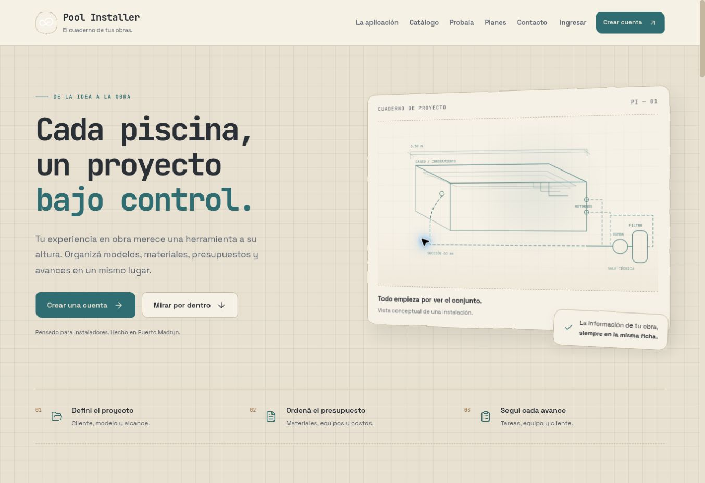
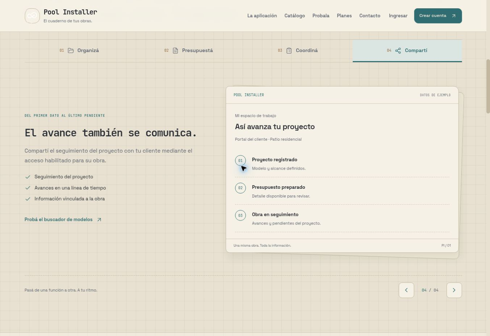
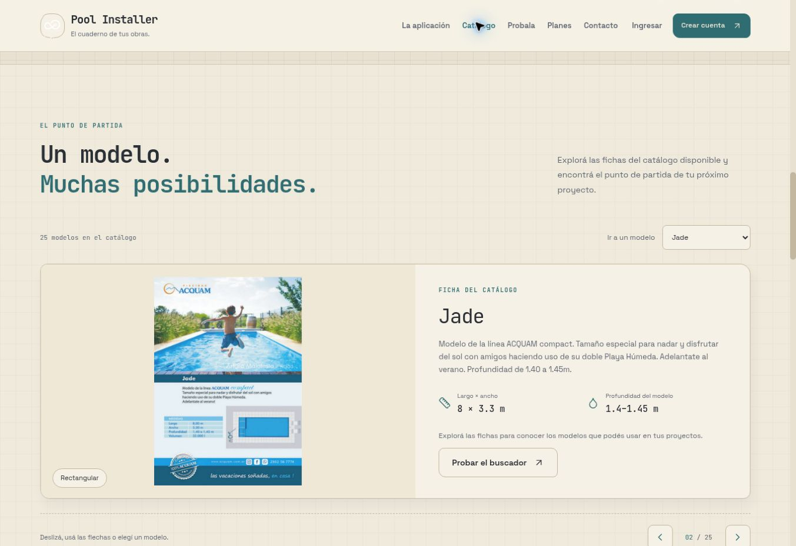
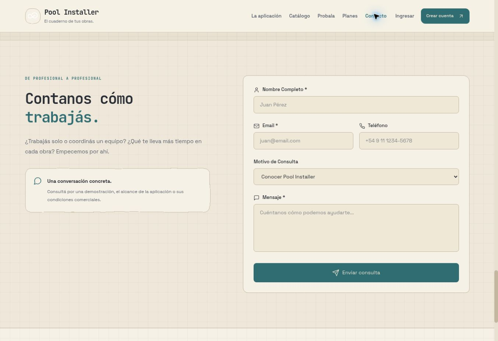

# Comprobación visual de la landing

Fecha: 2026-09-18. Resultado: **recorrido público verificado en escritorio; validación móvil e integraciones autenticadas pendientes**.

Se revisó la nueva versión publicada en https://jesus1942.github.io/PoolCalculator/ después del despliegue de GitHub Pages del cambio `adce697`. Navegador Chrome del entorno, ventana de 1363×936 y ancho útil observado de 1353 px con barra de desplazamiento. Las capturas incluidas son de esta ejecución, sin cuentas autenticadas ni datos de clientes. Cada archivo fue guardado y abierto para su inspección.

## Pasos comprobados

| Paso | Pantalla o interacción | Estado y evidencia |
| --- | --- | --- |
| 1 | Inicio y navegación | Correcto: mensaje principal legible, llamadas a crear cuenta/ver la aplicación, estética de cuaderno y tarjeta con perspectiva. Un solo pie en el DOM. Captura 01. |
| 2 | Recorrido de la aplicación | Correcto: pestaña Presupuestá cambia al paso 2; ArrowRight enfocado en el carrusel cambia al paso 3; Siguiente cambia al paso 4. Cambian textos, contenido y contador. El foco por teclado se distingue. Captura 02. |
| 3 | Catálogo público | Correcto: carga 25 modelos. El selector muestra Jade y sus medidas; ArrowRight cambia a Kriptonita y actualiza el selector/contador. La ficha y su imagen cargan. Captura 03. |
| 4 | Buscador por medidas | Correcto en la consulta realizada: 8 × 4 devuelve 12 modelos; se observó el estado «Consultando catálogo…» y luego los resultados. No se enviaron solicitudes de información. |
| 5 | Contacto | Correcto: el enlace Contacto termina en `#contact` y muestra el formulario de consulta comercial. Los campos tienen nombres accesibles. No se rellenó ni envió. Captura 04. |
| 6 | Ingreso | Correcto como pantalla pública: el enlace Ingresar abre `/PoolCalculator/login`, muestra correo, contraseña, recuperación y acceso al registro. No se probaron credenciales ni autenticación. |
| 7 | Registro | Correcto como pantalla pública: Crear cuenta abre `/PoolCalculator/register`; nombre, correo, contraseña mínima y confirmación se ven completos sin solapamientos. No se creó una cuenta. |
| 8 | Landing raíz de Railway | Correcto: https://poolcalculator-production.up.railway.app/ muestra la misma nueva landing y enlaces `/login` y `/register` apropiados para ese host. |
| 9 | Salud del backend | Correcto: las páginas públicas `/health` y `/ready` devolvieron `{"status":"ok"}` y `{"status":"ready"}`. |

## Evidencia visual

### 01. Inicio

### 02. Recorrido completo, paso Compartí

### 03. Catálogo, modelo Jade

### 04. Contacto

## Hallazgos y límites

- No se observaron bloqueos de navegación, superposiciones de texto ni desbordamiento horizontal en los pasos revisados. En el recorrido, `scrollWidth` y `clientWidth` fueron ambos 1353 px.
- La estética de papel, cuadrícula, bordes artesanales y tarjetas con profundidad se mantiene coherente. Se detectó poco contraste en el logo blanco y se corrigió el fondo de su tarjeta al verde azulado de la marca. Las cuatro capturas documentan la revisión previa a ese ajuste; queda una comprobación pública puntual del logo corregido.
- Se verificó el funcionamiento de los controles de los carruseles, no la calidad de la animación a todas las velocidades/dispositivos. Las capturas tomadas durante una transición se descartaron de la evidencia publicada.
- No se verificaron vista a 360 px, gestos táctiles, preferencias de movimiento reducido ni lectores de pantalla: esta sesión no expone ajuste del viewport. Las capturas de escritorio no demuestran conformidad WCAG.
- Las pantallas de acceso y registro fueron inspeccionadas y capturadas sin completar formularios. El panel privado de integraciones, Google OAuth, envío de recuperación, WhatsApp y Telegram requieren pruebas con configuración y sesión autorizadas; no se declaran validados por esta revisión.
- La landing aclara que precios y condiciones se confirman por contacto y que no procesa cobros. El cobro automático de suscripciones sigue fuera del recorrido validado.
- Tras el despliegue de Railway se comprobó su landing, `/health` y `/ready`. El catálogo y la búsqueda se habían consultado antes de ese reemplazo del backend; no constituyen una prueba completa de las rutas nuevas.
- La navegación directa del navegador a `/api/public/integrations` fue bloqueada con `net::ERR_BLOCKED_BY_CLIENT`; no se eludió ese bloqueo. La pantalla de ingreso de Pages se volvió a abrir después del despliegue y mostró correo/contraseña, sin botón Google ni error visible. Esto no determina por sí solo el estado de configuración del proveedor.
